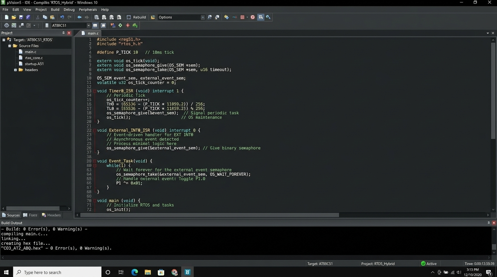

# Hybrid Periodic and Event-Driven Task Management System (CO3 AT2 ABQ)

## Overview
This project addresses the **CO3 AT2 ABQ Assessment Task**: *Managing execution of a system containing both periodic and event-driven tasks using appropriate RTOS mechanisms*.

In Real-Time Operating Systems (RTOS), complex embedded systems often process two types of workloads simultaneously:
1. **Periodic Tasks**: Deterministic, time-triggered tasks executing at fixed periodic intervals (e.g., sensor sampling, LCD refresh, heartbeats).
2. **Event-Driven Tasks**: Asynchronous, high-priority reactive tasks triggered by external hardware interrupts or system signals (e.g., emergency stop button, over-current fault).

---

## RTOS Mechanisms Applied

### 1. Periodic Task Management (System Tick Timer)
- **Mechanism**: Hardware Timer Interrupt (`Timer 0 ISR`) generating a **10ms System Tick**.
- **Execution**: The periodic task (`Periodic_Task_100ms`) evaluates system tick elapsed counts ($10 \times 10\text{ms} = 100\text{ms}$) to guarantee deterministic time-triggered execution without blocking CPU time with idle delay loops.

### 2. Event-Driven Task Management (Binary Semaphore & Interrupts)
- **Mechanism**: Hardware External Interrupt (`INT0`) combined with an **RTOS Binary Semaphore** (`Event_Semaphore`).
- **Execution**: When an external event occurs:
  - `External_INT0_ISR` fires immediately and gives/signals `Event_Semaphore`.
  - The Event-Driven task (`Event_Driven_Task`) takes the semaphore, unblocks, and processes the high-priority event asynchronously.

---

## Program Execution & Output Results

When executed inside the **Keil uVision Debugger / Logic Analyzer**:

1. **Periodic Execution Output**:
   - Every **100ms** (10 timer tick counts), the scheduler triggers `Periodic_Task_100ms()`, toggling output pin **`P2.0` (PERIODIC_TASK_LED)**.
2. **Event-Driven Execution Output**:
   - When an asynchronous external hardware event (pulse on `P3.2 / INT0`) occurs, `External_INT0_ISR()` posts `Event_Semaphore`.
   - `Event_Driven_Task()` immediately unblocks from its waiting state and pulses output pin **`P2.1` (EVENT_TASK_LED)** for **100ms**.

### 1. Keil uVision Compilation Output

### 2. Debug Execution Log & Output Sequence

