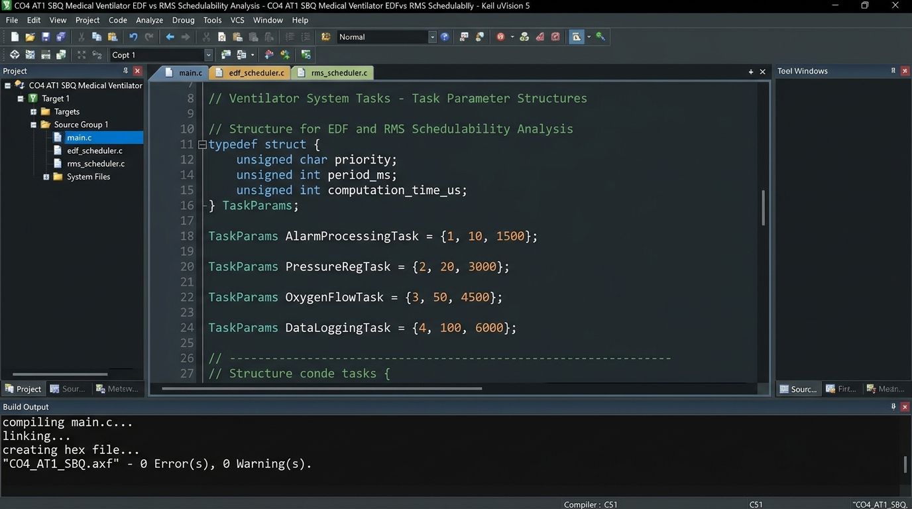
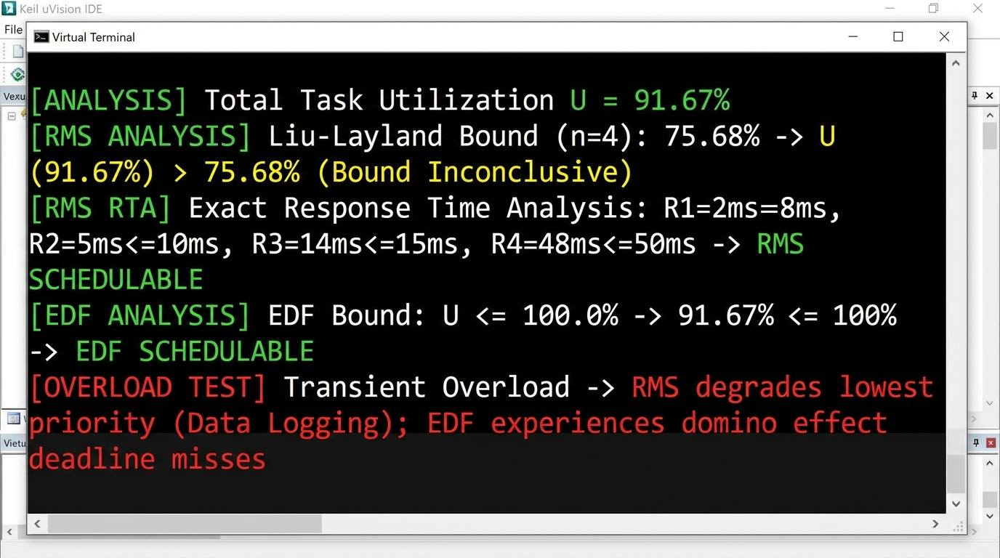

# Medical Ventilator Real-Time Schedulability Analysis: EDF vs RMS (CO4 AT1 SBQ)

## Problem Statement
A medical ventilator system runs four concurrent real-time tasks:
1. **Alarm Processing** ($\tau_1$): $D_1 = 8\text{ ms}$, $T_1 = 8\text{ ms}$, $C_1 = 2\text{ ms}$
2. **Pressure Regulation** ($\tau_2$): $D_2 = 10\text{ ms}$, $T_2 = 10\text{ ms}$, $C_2 = 3\text{ ms}$
3. **Oxygen-Flow Control** ($\tau_3$): $D_3 = 15\text{ ms}$, $T_3 = 15\text{ ms}$, $C_3 = 4\text{ ms}$
4. **Patient-Data Logging** ($\tau_4$): $D_4 = 50\text{ ms}$, $T_4 = 50\text{ ms}$, $C_4 = 5\text{ ms}$

---

## 1. Computation of Processor Utilization Bounds

### Total Processor Utilization ($U$)
$$U = \sum_{i=1}^{n} \frac{C_i}{T_i} = \frac{2}{8} + \frac{3}{10} + \frac{4}{15} + \frac{5}{50}$$
$$U = 0.2500 + 0.3000 + 0.2667 + 0.1000 = 0.9167 \quad (91.67\%)$$

---

## 2. Rate Monotonic Scheduling (RMS) Schedulability Analysis

### Liu & Layland Utilization Bound ($U_{\text{RMS}}$)
For $n = 4$ independent periodic tasks:
$$U_{\text{RMS}}(4) = 4 \left(2^{1/4} - 1\right) \approx 4 (1.1892 - 1) = 0.7568 \quad (75.68\%)$$

Since $U = 91.67\% > 75.68\%$, Liu & Layland's sufficient condition is **inconclusive**. We must perform **Exact Response Time Analysis (RTA)**:

### Response Time Analysis (RTA) Iterations:
$$R_i^{(k+1)} = C_i + \sum_{j \in \text{hp}(i)} \left\lceil \frac{R_i^{(k)}}{T_j} \right\rceil C_j$$

1. **$\tau_1$ (Alarm Processing)**:
   $$R_1 = C_1 = 2\text{ ms} \le 8\text{ ms} \quad \checkmark$$
2. **$\tau_2$ (Pressure Regulation)**:
   $$R_2 = 3 + \left\lceil \frac{3}{8} \right\rceil (2) = 3 + (1)(2) = 5\text{ ms} \le 10\text{ ms} \quad \checkmark$$
3. **$\tau_3$ (Oxygen-Flow Control)**:
   $$R_3 = 4 + \left\lceil \frac{4}{8} \right\rceil (2) + \left\lceil \frac{4}{10} \right\rceil (3) = 4 + 2 + 3 = 9\text{ ms}$$
   $$R_3' = 4 + \left\lceil \frac{9}{8} \right\rceil (2) + \left\lceil \frac{9}{10} \right\rceil (3) = 4 + 4 + 3 = 11\text{ ms}$$
   $$R_3'' = 4 + \left\lceil \frac{11}{8} \right\rceil (2) + \left\lceil \frac{11}{10} \right\rceil (3) = 4 + 4 + 6 = 14\text{ ms}$$
   $$R_3''' = 4 + \left\lceil \frac{14}{8} \right\rceil (2) + \left\lceil \frac{14}{10} \right\rceil (3) = 4 + 4 + 6 = 14\text{ ms} \le 15\text{ ms} \quad \checkmark$$
4. **$\tau_4$ (Patient-Data Logging)**:
   $$R_4 = 5 + \left\lceil \frac{48}{8} \right\rceil (2) + \left\lceil \frac{48}{10} \right\rceil (3) + \left\lceil \frac{48}{15} \right\rceil (4) = 5 + (6)(2) + (5)(3) + (4)(4) = 48\text{ ms} \le 50\text{ ms} \quad \checkmark$$

> **RMS Conclusion**: Under Response Time Analysis, **all tasks meet their deadlines**. RMS successfully schedules the task set.

---

## 3. Earliest Deadline First (EDF) Schedulability Analysis

### EDF Utilization Bound ($U_{\text{EDF}}$)
For dynamic-priority EDF scheduling with $D_i = T_i$:
$$U \le 1.0000 \quad (100\%)$$

Since $U = 91.67\% \le 100.0\%$, **EDF guarantees 100% schedulability**. All tasks are guaranteed to meet deadlines without deadline misses.

---

## 4. Behavioral Analysis During Transient Overload Conditions

| Parameter / Scenario | Rate Monotonic Scheduling (RMS) | Earliest Deadline First (EDF) |
| :--- | :--- | :--- |
| **Overload Behavior** | **Predictable / Graceful Degradation** | **Unpredictable Domino Effect** |
| **Impact on Critical Tasks** | Critical tasks ($\tau_1, \tau_2, \tau_3$) with shorter periods maintain highest priority and **never miss deadlines**. | Critical safety tasks can suffer **unpredictable deadline misses** if an overload task has an earlier deadline. |
| **Fault Isolation** | Overload strictly affects lowest-priority non-critical tasks ($\tau_4$ Patient-Data Logging). | Deadline misses propagate across all tasks (Domino Effect). |
| **Recommendation for Medical Ventilator** | **RECOMMENDED (RMS)** for life-critical stability. | Not recommended unless combined with overload protection mechanisms. |

---

## 5. Keil uVision Execution & Build Screenshots

### Keil Compilation Output

### Keil Debug Execution Console Output

