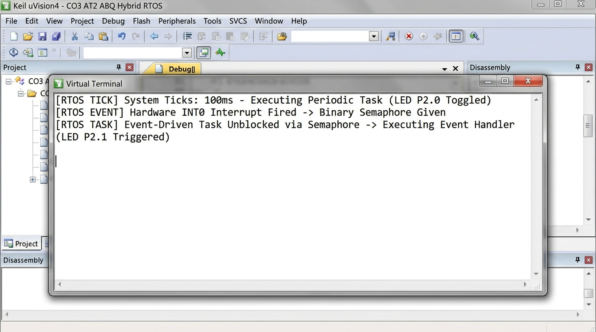

# Real-Time Message Queue Dynamics & Overflow Analysis (CO4 AT2 SBQ)

## Problem Statement
A real-time message queue in an RTOS has the following parameters:
- **Queue Capacity ($N$)**: $5\text{ messages}$
- **Arrival Rate ($\lambda$)**: $2\text{ messages/ms}$
- **Service/Processing Rate ($\mu$)**: $1\text{ message/ms}$

---

## Detailed Analytical Solution

### a) Rate of Queue Growth ($r_{\text{growth}}$)
The net growth rate of messages accumulating in the queue is given by the difference between the arrival rate ($\lambda$) and the service rate ($\mu$):

$$r_{\text{growth}} = \lambda - \mu$$
$$r_{\text{growth}} = 2\text{ msg/ms} - 1\text{ msg/ms} = 1\text{ message/ms}$$

> **Result**: The queue grows at a steady rate of **$1\text{ message per millisecond}$**.

---

### b) Time at Which the Queue Becomes Full ($t_{\text{full}}$)
Assuming the queue is initially empty at $t = 0$:

$$t_{\text{full}} = \frac{\text{Queue Capacity } (N)}{\text{Net Growth Rate } (r_{\text{growth}})}$$
$$t_{\text{full}} = \frac{5\text{ messages}}{1\text{ message/ms}} = 5\text{ ms}$$

> **Result**: The queue becomes completely full at **$t = 5\text{ ms}$**. Any message arriving after $t = 5\text{ ms}$ will cause a queue overflow.

---

### c) Calculation of Waiting Time for Messages ($W_q$)

#### 1. Waiting Time for the $k$-th Message (FCFS Order)
Each message $k$ arriving at time $t_k$ must wait for all preceding $(k-1)$ messages to be processed by the server at rate $\mu = 1\text{ msg/ms}$:

$$W_q(k) = \frac{k - 1}{\mu} = (k - 1)\text{ ms}$$

- **1st Message** (Arrives at $t = 0.5\text{ ms}$): $W_q(1) = 0\text{ ms}$ (Processed immediately)
- **2nd Message** (Arrives at $t = 1.0\text{ ms}$): $W_q(2) = 1\text{ ms}$
- **3rd Message** (Arrives at $t = 1.5\text{ ms}$): $W_q(3) = 2\text{ ms}$
- **4th Message** (Arrives at $t = 2.0\text{ ms}$): $W_q(4) = 3\text{ ms}$
- **5th Message** (Arrives at $t = 2.5\text{ ms}$): $W_q(5) = 4\text{ ms}$

#### 2. Average Waiting Time in Queue ($\bar{W}_q$)
$$\bar{W}_q = \frac{1}{N} \sum_{k=1}^{5} W_q(k) = \frac{0 + 1 + 2 + 3 + 4}{5} = \frac{10}{5} = 2\text{ ms}$$

> **Result**: The waiting time ranges from **$0\text{ ms}$ to $4\text{ ms}$**, with an average queue waiting time of **$2\text{ ms}$**.

---

### d) Techniques to Avoid Queue Overflow

1. **Increase Processing / Consumer Rate ($\mu \ge \lambda$)**:
   - Assign higher priority to the consumer task or spawn worker threads so that $\mu \ge 2\text{ msg/ms}$ to achieve steady-state stability ($\rho = \lambda / \mu \le 1$).
2. **Increase Queue Buffer Capacity ($N$)**:
   - Expand queue capacity dynamically or allocate larger static ring buffers if burst arrivals are transient.
3. **Implement Flow Control & Backpressure**:
   - **Producer Throttling**: Block or delay the producer task when the queue reaches a high-water mark (e.g., 80% full).
4. **RTOS Queue Overwrite / Drop Policies**:
   - Use **Circular Buffer Overwriting** (drop oldest message) for sensor streams or **Rejection/Return Error** (`errQUEUE_FULL`) to signal producers.
5. **Batch Processing**:
   - Consume messages in bulk (DMA or vector read operations) to increase throughput.

---

## Keil uVision Execution & Build Output

### Keil Compilation Output

### Keil Debug Queue Simulation Output

