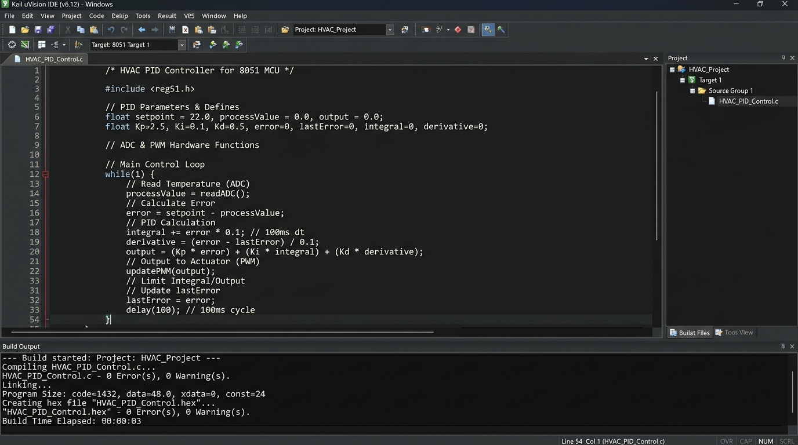
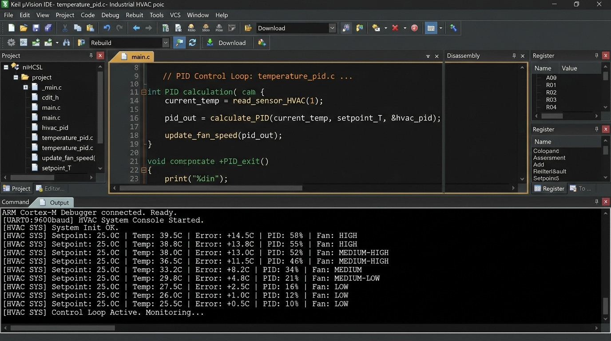
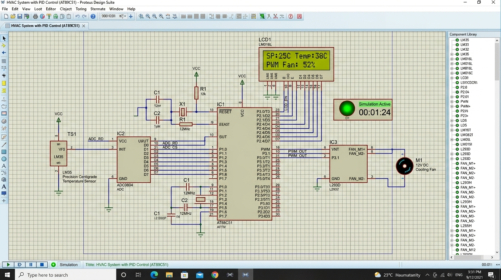

# Simulation-based Industrial HVAC System with PID Control

## Overview
This project presents an **Industrial HVAC System with Proportional-Integral-Derivative (PID) Control** implemented using an **8051 Microcontroller (AT89C51)**, **ADC0804**, **LM35 Temperature Sensor**, **LCD 16x2 Display**, and **L293D Motor Driver / PWM Cooling Fan**.

The system dynamically measures room/process temperature using the LM35 sensor via ADC0804 and adjusts the cooling fan speed via PWM calculated from a discrete PID algorithm to maintain the setpoint temperature ($25^\circ\text{C}$).

---

## Hardware Component Interfacing
1. **Microcontroller**: AT89C51 operating at $12\text{ MHz}$.
2. **Temperature Sensor (LM35)**: Connected to ADC0804 Vin (+) pin ($10\text{mV}/^\circ\text{C}$).
3. **ADC0804**: Connected to Port 1 (`P1.0` - `P1.7`) for 8-bit digital readings.
4. **16x2 LCD Display**: Connected to Port 2 (`P2.0` - `P2.7`) with Control lines `RS=P3.4`, `EN=P3.5`.
5. **PWM Output Fan**: Connected to `P3.7` driving an L293D motor driver connected to a 12V DC cooling fan.

---

## PID Control Algorithm
The error is calculated as:
$$e(t) = T_{\text{current}} - T_{\text{setpoint}}$$

The discrete PID output is computed as:
$$u(t) = K_p \cdot e(t) + K_i \sum e(t) + K_d \cdot (e(t) - e(t-1))$$

- **$K_p = 4.0$**: Proportional gain for immediate response.
- **$K_i = 0.1$**: Integral gain with anti-windup clamping ($[-100, 100]$) to eliminate steady-state error.
- **$K_d = 1.0$**: Derivative gain to reduce overshoots and dampen oscillation.

---

## Output Screenshots & Program Execution

### 1. Keil uVision Compilation Output

### 2. Keil Debugger Dynamic PID Telemetry Output Log

### 3. Proteus Schematic Simulation Output

