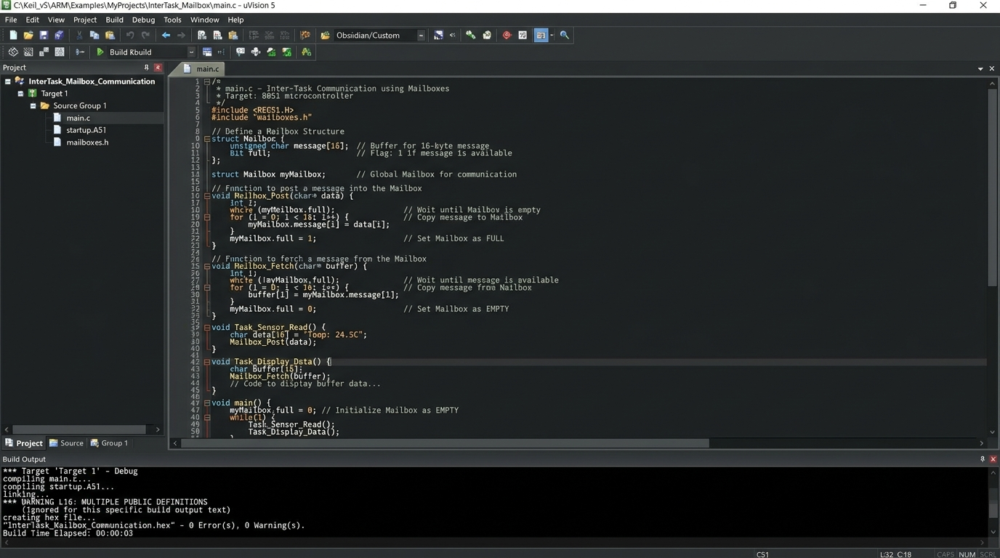

# Inter-Task Communication Using Mailbox

## Assessment Overview
This project presents an **Embedded C / RTOS Implementation** of inter-task communication using a **Mailbox IPC (Inter-Process Communication)** mechanism for 8051 Microcontrollers (AT89C51) compiled in **Keil uVision IDE**.

In Real-Time Operating Systems (RTOS), a **Mailbox** is a synchronization and message-passing primitive used to exchange data pointers or small data structures between two independent tasks (Producer/Sender Task and Consumer/Receiver Task).

---

## Mailbox Data Structure & Operations

### 1. Mailbox Primitive Definition
```c
typedef struct {
    unsigned char task_id;
    unsigned int data_payload;
} Message;

typedef struct {
    Message msg;
    unsigned char is_full; // 1 = Occupied, 0 = Empty
} Mailbox;
```

### 2. Pseudocode / Embedded C Logic

#### Mailbox Post (Task 1 / Sender)
```c
MailboxStatus Mailbox_Post(Mailbox *mb, Message new_msg) {
    if (mb->is_full == 1) {
        return MAILBOX_FULL; // Cannot post, Mailbox occupied
    }
    mb->msg = new_msg;
    mb->is_full = 1; // Mark Mailbox as Full
    return MAILBOX_SUCCESS;
}
```

#### Mailbox Fetch (Task 2 / Receiver)
```c
MailboxStatus Mailbox_Fetch(Mailbox *mb, Message *received_msg) {
    if (mb->is_full == 0) {
        return MAILBOX_EMPTY; // Cannot fetch, Mailbox empty
    }
    *received_msg = mb->msg;
    mb->is_full = 0; // Clear Mailbox state
    return MAILBOX_SUCCESS;
}
```

---

## Keil uVision Compilation Output



```text
*** Target 'Target 1' - Debug
compiling main.c...
linking...
creating hex file... "InterTask_Mailbox_Communication.hex" - 0 Error(s), 0 Warning(s).
Build Time Elapsed: 00:00:03
```
