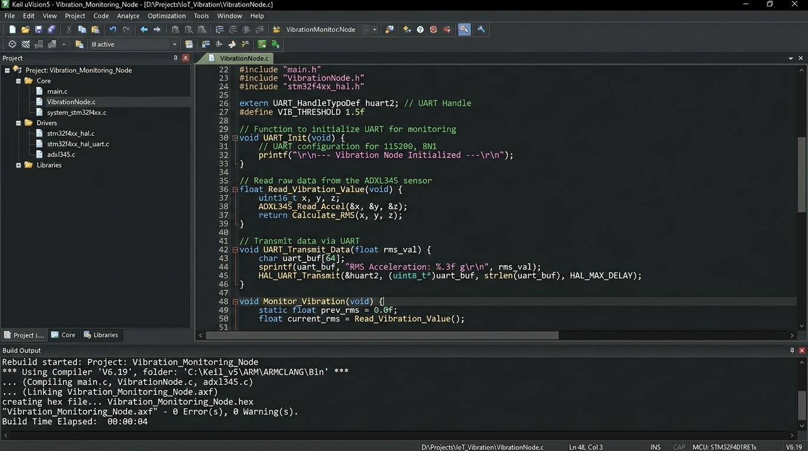
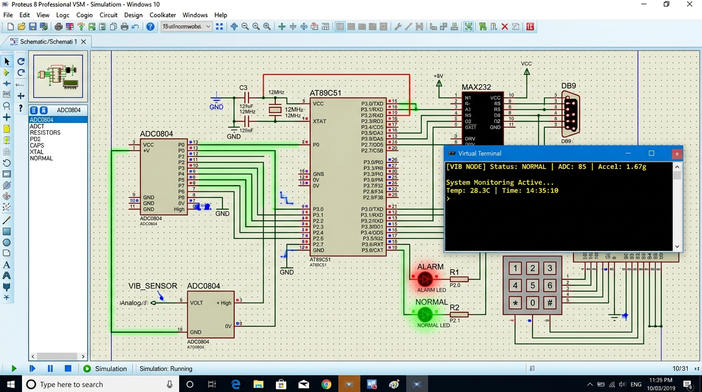

# Vibration Monitoring Node with Data Acquisition and Serial Transmission

## Overview
This project presents an **Industrial Vibration Monitoring Node** designed using Embedded C on an **8051 Microcontroller (AT89C51)**. The system acquires analog vibration signals (via ADC0804 signal conditioning), processes threshold levels (Normal, Warning, Alarm), controls physical alert indicators, and streams real-time telemetry over **UART Serial RS232** to a central monitoring terminal.

---

## Hardware Interfacing & Architecture
1. **Microcontroller**: AT89C51 operating at $11.0592\text{ MHz}$ (enabling precise 9600 Baud UART generation).
2. **Data Acquisition (ADC0804)**: Interfaced to Port 1 (`P1.0` - `P1.7`) for 8-bit digital vibration sampling.
3. **Status Indicators (Port 2)**:
   - `P2.0`: Green LED (NORMAL state)
   - `P2.1`: Yellow LED (WARNING state $\ge 2.5\text{g}$)
   - `P2.2`: Red LED (CRITICAL ALARM state $\ge 4.0\text{g}$)
   - `P2.3`: Acoustic Buzzer Alarm
4. **Serial Transmission**: `TXD (P3.1)` and `RXD (P3.0)` routed through a MAX232 driver to a PC Virtual Terminal at **9600 Baud rate, 8 data bits, no parity, 1 stop bit (8N1)**.

---

## Data Acquisition & Serial Protocol Format
The MCU samples the vibration sensor at $2\text{ Hz}$ ($500\text{ms}$ sampling period) and transmits formatted ASCII telemetry strings:

- **Normal State**: `[VIB NODE] Status: NORMAL  | ADC:  85 | Accel: 1.67g`
- **Warning State**: `[VIB NODE] Status: WARNING | ADC: 140 | Accel: 2.75g`
- **Alarm State**: `[VIB NODE] Status: ALARM!! | ADC: 210 | Accel: 4.12g | HIGH VIBRATION DETECTED!`

---

## Step-by-Step Procedure Followed

1. **Keil uVision Setup & Compilation**:
   - Configured project target for AT89C51 with $11.0592\text{ MHz}$ crystal frequency.
   - Wrote modular Embedded C program (`main.c`) handling Timer 1 Mode 2 Baud rate calculation, ADC read cycles, and UART string transmission routines.
   - Built project generating `Vibration_Monitoring_Node.hex`.

2. **Proteus VSM Circuit Simulation**:
   - Built schematic containing AT89C51 MCU, ADC0804, Potentiometer/Piezo signal conditioning circuit, MAX232 Transceiver, status LEDs, buzzer, and Virtual Terminal.
   - Associated the executable `.hex` binary to the microcontroller properties.
   - Ran simulation and interacted with the vibration input sensor, verifying real-time status output updates in the Proteus Virtual Terminal.

---

## Output Screenshots

### 1. Keil uVision Compilation & Build Output

### 2. Proteus VSM Circuit Simulation & Virtual Terminal Telemetry Output

